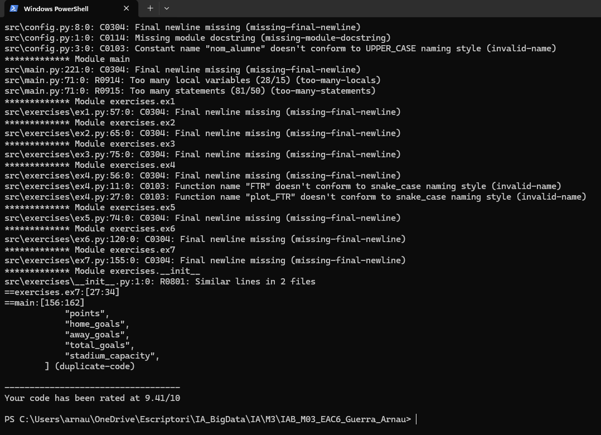
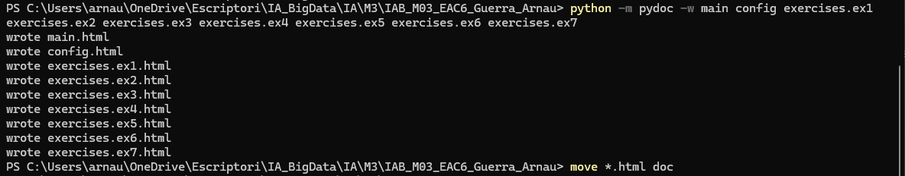

# EAC6 — Programació d’Intel·ligència Artificial

**Nom i Cognom:** Arnau Guerra González  
**Títol del projecte:** Anàlisi històrica de LaLiga (1995–2025)

Aquest repositori correspon a l’**EAC6** del mòdul *Programació d’Intel·ligència Artificial* (especialització IA i Big Data). Inclou càrrega i exploració de dades, estadístiques, visualitzacions, punts i classificació, resum per equip amb capacitat d’estadi, clustering amb KMeans i inferència sobre un equip nou.

---

## Estructura del projecte

```
IAB_M03_EAC6_Guerra_Arnau/
├── src/
│   ├── main.py              # Punt d’entrada: executa tots els exercicis
│   ├── config.py            # Camins i metadades
│   ├── data/
│   │   └── LaLiga_Matches.csv
│   ├── img/                 # Gràfiques generades
│   ├── model/               # Models guardats (si s’utilitzen)
│   └── exercises/
│       ├── __init__.py
│       ├── ex1.py … ex7.py  # Un fitxer per exercici
├── tests/
│   └── tests_ex6.py         # Tests de l’exercici 6
├── doc/                     # HTML generats amb pydoc
│   ├── ex1.py … ex7.py      # Un fitxer per exercici
│   ├── main.html            
│   ├── config.html            
├── screenshots/             # Captures de pantalla
├── requirements.txt
├── README.md
└── LICENSE
```

---

## Instal·lació (entorn virtual net)

Des del directori arrel del projecte (`IAB_M03_EAC6_Guerra_Arnau`), en **PowerShell**:

```powershell
python -m venv .venv
.\.venv\Scripts\Activate.ps1
python -m pip install --upgrade pip
python -m pip install -r requirements.txt
```

Per desactivar el venv més endavant: `deactivate`.

---

## Execució del projecte

Els camins del dataset i de les carpetes `img` i `model` es resolen a `config.py` **a partir de la carpeta `src/`** (`Path(__file__)`), de manera que el CSV es troba encara que canviï el directori de treball. Per mantenir el costum del projecte, recomano executar des de l’**arrel del repositori**.

Amb el venv activat:

```powershell
python src/main.py
```

---

## Comprovació de l’anàlisi estàtic (Pylint)

Amb el venv activat i des de l’arrel del projecte:

```powershell
python -m pylint src\main.py src\config.py src\exercises
```

Opcionalment, per un fitxer concret:

```powershell
python -m pylint src\exercises\ex6.py
```


---

## Generació de la documentació (pydoc)

Des de l’arrel del projecte, amb `PYTHONPATH` apuntant a `src` perquè es resolguin els mòduls `exercises` i `config`:

```powershell
$env:PYTHONPATH = "src"
python -m pydoc -w main config exercises.ex1 exercises.ex2 exercises.ex3 exercises.ex4 exercises.ex5 exercises.ex6 exercises.ex7
Move-Item -Path *.html -Destination doc -Force
```

Per obrir la documentació al navegador (exemple):

```powershell
start doc\main.html
```

**Captura:** documentació HTML generada amb pydoc.



---

## Comprovació dels tests (pytest)

Amb el venv activat, des de l’arrel:

```powershell
python -m pytest tests
```

Per veure més detall:

```powershell
python -m pytest tests -v
```

**Captura:** execució de `pytest` sobre `tests/`.


---

## Fitxers `requirements.txt` i `LICENSE`

- **`requirements.txt`**: dependències del projecte (`pandas`, `matplotlib`, `scikit-learn`, `pylint`, `pytest`). S’utilitza amb `pip install -r requirements.txt` dins del venv.
- **`LICENSE`**: llicència del codi (MIT). Consulteu el fitxer per al text complet.

---

## Referències

- Enunciat i material de l’EAC6 (mòdul Programació d’Intel·ligència Artificial, IAB M03).
- [Python 3](https://docs.python.org/3/)
- [Type hints (Real Python)](https://realpython.com/ref/glossary/type-hint/)
- [Series](https://pandas.pydata.org/docs/reference/api/pandas.Series.html) i [DataFrame](https://pandas.pydata.org/docs/reference/api/pandas.DataFrame.html)
- [Matplotlib](https://matplotlib.org/stable/users/explain/quick_start.html)
- [scikit-learn](https://scikit-learn.org/stable/) i [preprocessing](https://scikit-learn.org/stable/modules/preprocessing.html)
- [Pylint](https://pylint.readthedocs.io/)
- [pytest](https://docs.pytest.org/en/stable/)
- [pydoc](https://docs.python.org/3/library/pydoc.html)

---

## Comandes per pujar el projecte a GitHub

1. Creeu un repositori buit a GitHub (sense README si ja en teniu un local).

2. Des de l’arrel del projecte, en PowerShell:

```powershell
git init
git branch -M main
git add .
git commit -m "Primera versió EAC6 LaLiga"
git remote add origin https://github.com/Arniwar/Historical-analysis-of-LaLiga-1995-2025.git
git push -u origin main
```

Per a commits posteriors:

```powershell
git add .
git commit -m "Descripció del canvi"
git push
```
